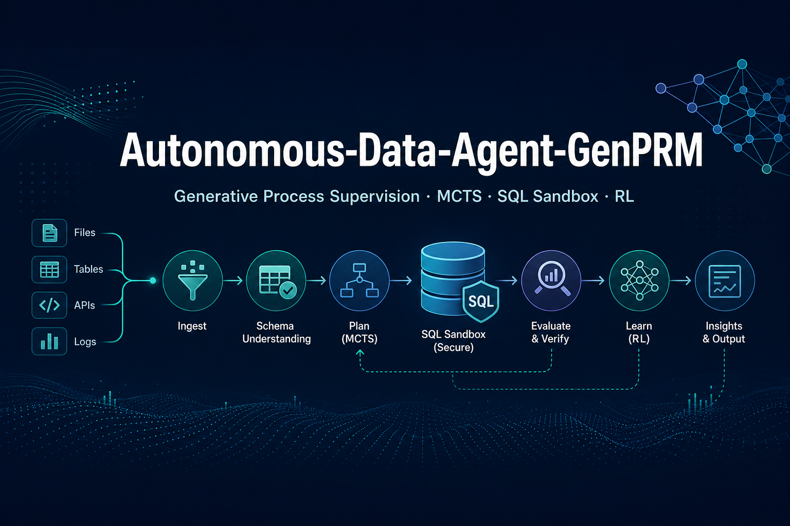

<p align="center">
  
</p>

# Autonomous-Data-Agent-GenPRM

[](https://pypi.org/project/genprm/)
[](https://github.com/vaquarkhan/autonomous-data-engineering-agent)
[](https://github.com/vaquarkhan/autonomous-data-engineering-agent)

An **autonomous data engineering agent** that generates, verifies, and self-corrects complex SQL queries and ETL pipelines using generative process supervision, sandbox execution feedback, MCTS inference, and RL fine-tuning with reward-hacking safeguards.

**Repository:** [github.com/vaquarkhan/autonomous-data-engineering-agent](https://github.com/vaquarkhan/autonomous-data-engineering-agent)

## Install from PyPI

```bash
pip install genprm

# With dev tools (pytest, coverage)
pip install "genprm[dev]"

# With LLM client extras (OpenAI-compatible API)
pip install "genprm[llm]"
```

## Quick Start

```bash
python -m venv .venv
.venv\Scripts\activate          # Windows
pip install -e ".[dev]"

# Verify 100% test coverage
pytest

# Run full pipeline (Modules 1-4)
python scripts/run_pipeline.py
```

## CLI Commands

| Command | Module | Description |
|---------|--------|-------------|
| `genprm-generate-cocte` | 1 | CoCTE synthetic data + auto-labeling |
| `genprm-train-genprm` | 2 | GenPRM SFT dataset preparation |
| `genprm-mcts-infer` | 3 | MCTS inference with early exit |
| `genprm-train-rl` | 4 | ReCode GRPO + PURE min-form RL |

## Architecture

```
Module 1: Trajectories -> Diversity Filter -> Sandbox -> Auto-Labels -> Export
Module 2: PRM JSONL -> CoT+Yes/No SFT dataset (GenPRM format)
Module 3: MCTS search + GenPRM value function + adaptive boosting
Module 4: GRPO with execution gate + PURE min-form advantages
```

## Documentation

- [Product Requirements (PRD)](docs/PRD.md)
- [Architecture](docs/ARCHITECTURE.md)
- [Tutorials](docs/tutorials/README.md)

## Foundational Repositories

| Repo | Contribution |
|------|-------------|
| [RyanLiu112/GenPRM](https://github.com/RyanLiu112/GenPRM) | Generative PRM |
| [ruc-datalab/rewardsql](https://github.com/ruc-datalab/rewardsql) | CoCTE + sandbox |
| [THUDM/ReST-MCTS](https://github.com/THUDM/ReST-MCTS) | MCTS inference |
| [CJReinforce/PURE](https://github.com/CJReinforce/PURE) | Min-form credit assignment |

## Testing

```bash
pip install -e ".[dev]"
pytest                    # 100% statement coverage enforced
pytest --cov-report=html  # HTML report in htmlcov/
```

## Project Structure

```
src/genprm/
├── phase1/    # Synthetic data & auto-labeling (complete)
├── phase2/    # GenPRM SFT dataset & inference (complete)
├── phase3/    # MCTS engine (complete)
└── phase4/    # ReCode GRPO + PURE (complete)
config/        # phase1.yaml ... phase4.yaml
docs/          # PRD, architecture, tutorials
tests/         # 140 tests, 100% coverage
scripts/       # run_pipeline.py
```

## License

Apache 2.0
